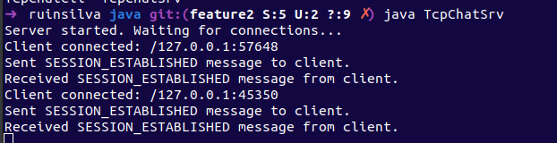
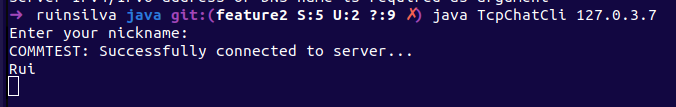
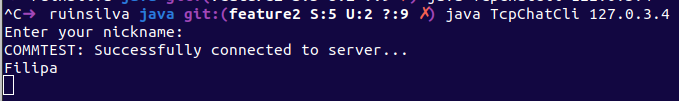
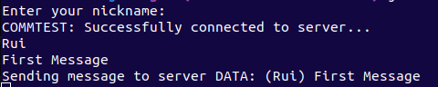
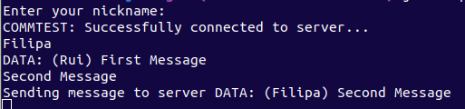
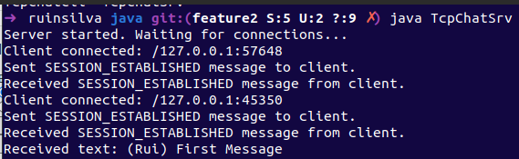
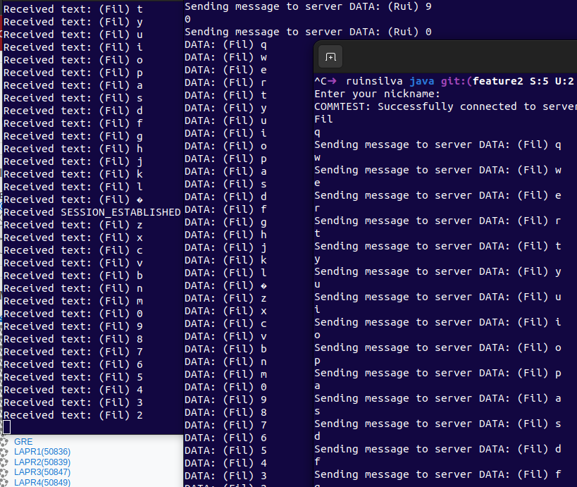
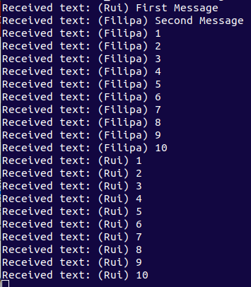
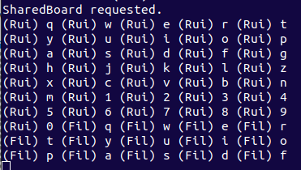

# RCOMP - Shared Board App

## Description

This project implements a simple TCP chat server and client using the SBP (Shared Board Protocol) for message exchange.
The server listens for client connections, handles message broadcasting, and maintains a shared list of messages posted
by clients. The client establishes a connection to the server, sends and receives messages using the SBP protocol, and
allows users to post messages and request the shared board.

### TcpChatSrv:

* This class represents a TCP chat server that listens for client connections and handles the communication with multiple
clients.
* It contains a main method where the server socket is created and waits for client connections.
* It maintains a list of connected clients (cliList) and a list of messages posted by clients (msgList).
* The initializeMessageList method initializes the msgList with empty strings.
* The addText method adds a new message to the msgList.
* The updateListSize method updates the size of the msgList when it reaches its maximum capacity.
* The printList method prints the contents of the msgList.
* The getMessages method returns the msgList.
* The broadcastText method sends a message to all connected clients.
* The removeConnection method removes a client connection from the cliList.

### ClientConnection:

This class represents a client connection thread that handles the communication with a connected client.
It implements the Runnable interface, allowing it to be executed as a separate thread.
It receives a socket as a parameter during initialization and sets up the input and output streams for communication.
The sendToAll method sends a message to all connected clients using the SBP protocol.
The run method is the main method of the thread and handles the communication with the client.
It receives messages from the client, processes them based on their codes, and performs appropriate actions.
Messages with codes 6, 5, 1, and 0 correspond to requesting the shared board, posting text, disconnecting, and session
establishment, respectively.
When the client disconnects, the removeConnection method is called to remove the client connection from the server's
client list.

### SBPMessage:

* This class represents the Shared Board Protocol format used for communication between the server and clients.
* It provides methods to serialize a message into a byte array and retrieve information from a serialized message.
* The constructor initializes the message properties such as version, code, data length, and data.
* The serialize method converts the message object into a byte array following the SBP protocol structure.
* The toString method provides a string representation of the message object for debugging purposes.
* The class also includes getter methods to retrieve specific properties of the message.
 
 

Together, these classes form a TCP chat server and client implementation using the SBP protocol for message
exchange. The server listens for client connections, handles message broadcasting, and maintains a shared list of
messages posted by clients. The client establishes a connection to the server, sends and receives messages using the SBP
protocol, and allows users to post messages and request the shared board.

## Server initialization + User's connecting

 

 

## User's sending messages + System receiving messages
 

 

 

## Just for showing purposes, each user wrote numbers from 0 to 10 and several letters representing messages
 

## User's requesting shared board
In order to visualize the Shared Board, the user types "SharedBoard"
 

